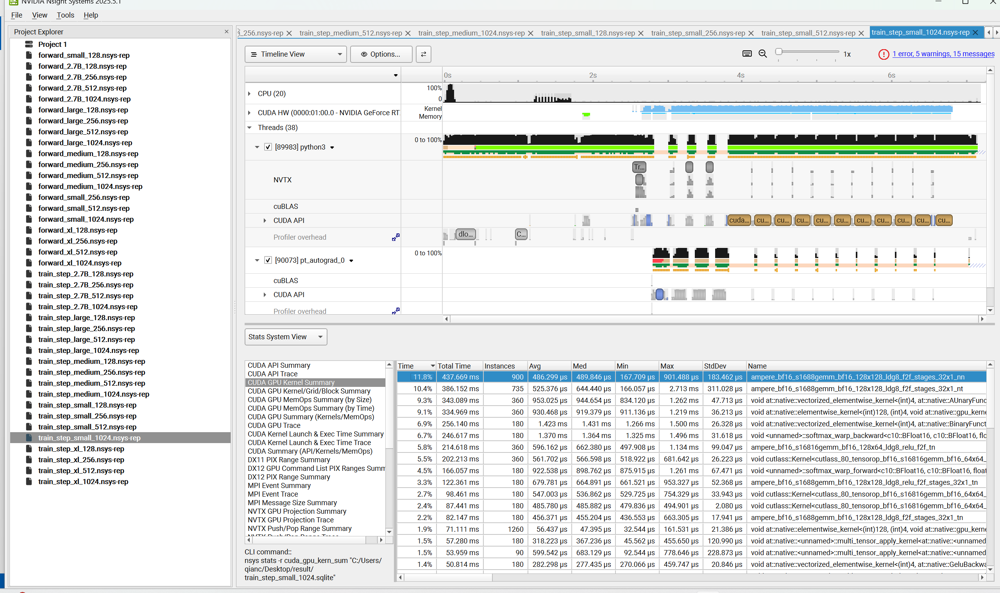

### Problem (benchmarking_script): 4 points


(a)代码在cs336_systems/benchmark_profile.py
(b)在benchmark_results.csv
(c)在benchmark_results.csv里面，标准差和平均耗时都变大了

### Problem :

(a)用timeit记录的时间更长一点，用nsys记录的放在result文件夹下，其中xl和2.7B的模型都有一点问题
(b)forward时调用最多的GPU内核是ampere_bf16_s16816gemm_bf16_128x64_ldg8_relu_f2f_tn

但是在full training中调用时间最长的是另一个

(c)逐元素运算 (elementwise kernels) → mul、add、masked fill 等 (~20% 以上累计)。

Softmax 前向 (softmax_warp_forward) (~4–5%)。

激活函数 (GELU) (~1%)。

LayerNorm 前向 (~0.5%)。

(d)训练步骤中矩阵乘法的时间占比会显著高于推理。这是因为反向传播（backward pass）本质上就是利用链式法则计算梯度，这个过程会引入大量的矩阵乘法来计算权重的梯度。

(e)FLOPs 差异： 矩阵乘法 FLOPs >>> Softmax FLOPs。

运行时长差异： 矩阵乘法运行时长可能只略长于或与 Softmax 相当，而不是像 FLOPs 那样呈数量级差距。


### problem

```bash
root@1ee5b610c063:/home/code_backup/code/cs336/assignment2-systems# python3 cs336_systems/mix_presicion.py
tensor(10.0001)
tensor(9.9531, dtype=torch.float16)
tensor(10.0021)
tensor(10.0021)
```


### problem 


(a)
• the model parameters within the autocast context : FP16
• the output of the first feed-forward layer (ToyModel.fc1),  FP16
• the output of layer norm (ToyModel.ln),  FP32
• the model’s predicted logits,  FP32
• the loss,  FP32
• and the model’s gradients?  FP32

 - autocast上下文中的模型参数: 模型参数（即self.fc1.weight, self.fc2.weight）的原始数据类型保持FP32不变。autocast并不会改变存储在模型中的参数类型，而是在进行计算时，根据操作类型将输入或权重转换为FP16。

 - 第一个全连接层（ToyModel.fc1）的输出: FP16。像全连接层（矩阵乘法）这样的计算密集型操作，会被autocast自动识别并转换为FP16进行计算，以获得更高的性能。

 - 层归一化（ToyModel.ln）的输出: FP32。**层归一化（LayerNorm）**通常需要更高的精度来避免数值不稳定，因为它涉及到均值和方差的计算。因此，autocast通常会将这类操作保留在FP32以保证训练的稳定性。

 - 型的预测logits: FP32。由于最后一个全连接层fc2的输入（来自ln）是FP32，并且autocast倾向于将累积和归约操作保持在FP32，因此最终的输出（即logits）也会是FP32。

 - 损失（loss）: FP32。损失通常是在FP32中计算的，以避免累积的舍入误差。即使前向传播的部分操作在FP16中进行，autocast也会将结果转回FP32进行损失计算。

 - 模型的梯度: 在标准的混合精度训练流程中，反向传播的梯度在计算过程中会保持FP16，但在梯度更新前，会转换为FP32。这是因为：

 - 为了加速反向传播，梯度计算通常在FP16下进行。为了避免梯度值在FP16中归零，会使用梯度缩放（loss scaling）。最终，梯度在更新模型参数时会转换为FP32，因为模型参数本身就是FP32，并且FP32的精度更高，有助于参数更新的稳定。


(b)层归一化对混合精度非常敏感，主要原因在于其计算过程中的均值（mean）和方差（variance）计算。这些统计量需要对整个层进行累加和求和，这个过程中非常容易产生数值下溢或上溢，导致精度损失或NaN值。

(c)对应的代码是`assignment2-systems/cs336_systems/mixed_precision_benchmark.py`,运行脚本是`assignment2-systems/cs336_systems/run_mixed_precision_profile.sh`
运行结果存在`assignment2-systems/mixed_precision_results.csv`

表现良好的情况：
Small/Medium模型 + 较大context length：1.5-2.0x加速
计算量充足，能充分利用BF16加速

表现较差的情况：
XL模型 + batch_size=1：0.04-0.97x（变慢）
计算并行度不足，转换开销占主导

最优配置：
Medium模型，context length 256-512：~1.7-2.0x加速
在计算量和内存使用之间找到平衡点

### problem 

(a)物品的电脑运行2.7B模型会崩溃，所以用了xl代替（混合精度），每轮测量时都有5次warm up

 - inference only:
 - fulling training:
内存时间线分析与区分
第一张图（纯前向传播）：

内存变化模式：随着前向传播的进行，模型的每一层都会产生新的激活值，这些激活值被保存在显存中，导致内存使用量平稳且持续地增加，直到达到峰值。

峰值与释放：内存峰值出现在前向传播结束时。此时，模型所有层的激活值都已生成。由于是纯推理模式，不需要计算梯度，因此在前向传播结束后，这些激活值可以被逐步或全部释放，导致内存使用量缓慢下降。

主要内存来源：峰值主要由模型参数和前向传播过程中产生的激活值组成。

第二张图（完整训练步骤）：

内存变化模式：

前向传播：与第一张图类似，内存使用量平稳增加。但由于需要保存用于反向传播的中间激活值，内存占用通常会比纯推理模式更高。

反向传播：到达前向传播的峰值后，开始计算梯度。反向传播会临时分配新的显存来存储梯度，这使得内存使用量出现一个更陡峭、更高的峰值。

梯度清零：在反向传播和优化器步骤结束后，用于存储梯度和部分中间激活值的显存会被大量释放，因此内存使用量会急剧下降。

主要内存来源：这个阶段的峰值由模型参数、前向激活值和梯度张量共同组成。

如何区分两个过程
通过观察内存时间线，你可以根据以下两点来区分前向传播和完整的训练过程：

内存峰值：完整训练过程（前向+后向）的内存峰值明显高于纯前向传播，因为反向传播需要额外的显存来存储梯度。

内存释放模式：纯前向传播的内存释放是平缓的，因为它主要是在推理结束后释放激活值。而完整训练过程在反向传播完成后会出现一个突然且大幅度的内存下降，这对应着梯度和中间张量的释放，这是一个非常明显的标志。

(b)具体的pkl保存在`./memory_snapshot/fp32`中

| 上下文强度 | 前向传播峰值显存 (Peak Memory in MB/GB) | 完整训练步骤峰值显存 (Peak Memory in MB/GB) |
| ----- | ------------------------------- | --------------------------------- |
| 128   | 6.3                             | 12.0                              |
| 256   | 7.1                             | 12.8                              |
| 512   | 9.2                             | memory报错                          |


(c)具体的pkl保存在`./memory_snapshot/mixed_presicion`中,比float32内存峰值小很多（约0.5倍）

| 上下文(context length) | 前向传播峰值显存 (Peak Memory in MB/GB) | 完整训练步骤峰值显存 (Peak Memory in MB/GB) |
| ----- | ------------------------------- | --------------------------------- |
| 128   | 3.1                             | 6.0                               |
| 256   | 3.6                             | 6.4                               |
| 512   | 4.6                             | 7.5                               |

(d)
残差流上的激活张量通常的形状是 (batch_size, block_size, embed_dim)。题目要求计算单个张量的大小，我们可以假设 batch_size 为 1。

 - 计算张量元素总数：

    元素总数 = block_size × embed_dim

    元素总数 = 512 × 2560 = 1,310,720

 - 计算字节数（单精度 FP32）：

    单精度浮点数（FP32）占用 4 个字节。

    总字节数 = 元素总数 × 4

    总字节数 = 1,310,720 × 4 = 5,242,880 字节

 - 转换为 MB：

    将字节数除以 1024 * 1024
    （即 1,048,576）。

    大小（MB） = 5,242,880 / 1,048,576 ≈ 5.0 MB

(e)大的分配主要来自 MLP 模块内部的计算，即：

为 线性层（Linear Layer） 的矩阵乘法结果分配的张量 (约 3.1 MiB)。

为 GELU 激活函数 的输出分配的张量 (约 3.1 MiB)。

### problem

代码在`cs336_systems/pytorch_attention_profile.py`  
| d_model | seq_len | forward_time | backward_time | memory_usage_mb | status |
|--|---|---|---|---|-----|
| 16 | 256 | 0.000252 | 0.000672 | 19.125 | OK |
| 16 | 1024 | 0.001081 | 0.00314 | 51.75 | OK |
| 16 | 4096 | 0.015391 | 0.047806 | 542.25 | OK |
| 16 | 8192 | 0.061903 | 0.682544 | 2092.25 | OK |
| 16 | 16384 | N/A | N/A | N/A | OOM |
| 32 | 256 | 0.000083 | 0.000584 | 20.0 | OK |
| 32 | 1024 | 0.001023 | 0.003058 | 55.25 | OK |
| 32 | 4096 | 0.015733 | 0.038343 | 556.25 | OK |
| 32 | 8192 | 0.061436 | 0.597976 | 2120.25 | OK |
| 32 | 16384 | N/A | N/A | N/A | OOM |
| 64 | 256 | 0.000575 | 0.001372 | 21.75 | OK |
| 64 | 1024 | 0.00107 | 0.003126 | 62.25 | OK |
| 64 | 4096 | 0.015507 | 0.036756 | 584.25 | OK |
| 64 | 8192 | 0.06332 | 0.765987 | 2176.25 | OK |
| 64 | 16384 | N/A | N/A | N/A | OOM |
| 128 | 256 | 0.000743 | 0.001004 | 25.25 | OK |
| 128 | 1024 | 0.001243 | 0.003604 | 76.25 | OK |
| 128 | 4096 | 0.01764 | 0.050293 | 640.25 | OK |
| 128 | 8192 | 0.175377 | 1.10893 | 2288.25 | OK |
| 128 | 16384 | N/A | N/A | N/A | OOM |


显存不足发生在 d_model=16, seq_len=16384 的配置。

对于这个 OOM 配置的内存使用估算:
  Q, K, V 张量所需内存: 24.00 MB

  注意力分数矩阵 (S) 所需内存: 8192.00 MB

  注意力输出 (A) 所需内存: 8.00 MB

  总前向传播所需显存: 约 8224.00 MB

  总后向传播所需显存 (额外): 约 8192.00 MB


 - 减少内存成本的方法：

     - 切片（Tiling）: 它将输入 Q、K、V 切成小块（tile），并逐块计算注意力。每次只将一个tile加载到GPU的快速SRAM中进行计算，然后将结果（累积的Softmax和输出）写回DRAM。这样就不需要一次性存储整个巨大的注意力分数矩阵。

     - 避免存储中间结果: FlashAttention-2 巧妙地设计了前向和后向传播的计算流，使得反向传播时，可以重新计算而不是存储中间结果。具体来说，它在反向传播时，会再次使用与前向传播相同的切片技术，逐块计算梯度，这样就避免了保存整个 T×T 矩阵。


### problem


答案是`transformer_performance_analysis.html`
