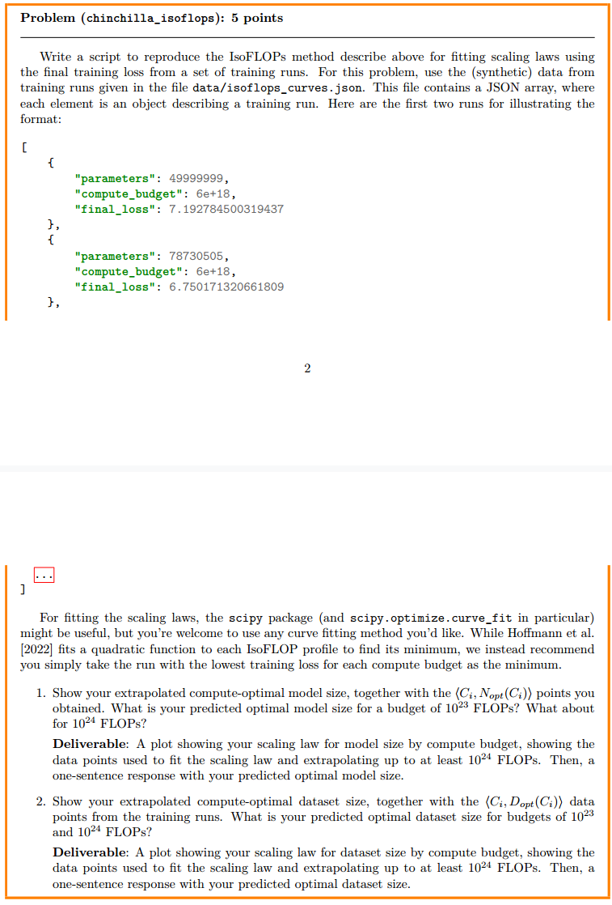

### problem1

代码在`assignment3-scaling/cs336_scaling/scaling_laws.py`
结果在`result`文件夹下

### problem2
我无法使用api，所以直接让AI生成了一个自动的合理的回复
-----

### 1\. 任务翻译与解读

#### **原文翻译**

为了构建你的缩放法则（scaling laws），你将使用我们的训练API来查询实验配置的训练结果（§3.1）。你的目标是利用这个缩放法则，为一个 $10^{19}$ FLOPs 的计算预算，精确预测出最优的模型大小以及相关的训练损失。为了给预测出的最优模型大小设置超参数，我们建议你先在较小规模的设置上分析超参数是如何影响训练损失的。在开始之前，请务必仔细规划你的实验运行——一旦你用于拟合缩放法则的实验总计算量超过 $2 \\times 10^{18}$ FLOPs，训练API将拒绝后续的请求。

**问题 (scaling\_laws): 50分**
构建一个缩放法则，为一个 $10^{19}$ FLOPs 的计算预算，精确地预测出最优的模型大小、其超参数，以及相关的训练损失。为了构建你的缩放法则，你将使用我们的训练API查询各种实验配置下的最终训练损失（§3.1）；你用于拟合缩放法则的实验计算量**不得超过** $2 \\times 10^{18}$ FLOPs。这是一个由API强制执行的硬性上限。

**关于批次大小 (Batch size) 的说明:**
我们对你在 $10^{19}$ FLOPs 预算下报告的超参数几乎没有限制，除了以下要求：你的**批次大小必须是128或256**。这样做是为了确保运行具有合理的模型FLOPs利用率。如果在运行你报告的超参数配置时我们遇到内存不足（OOM）错误，我们将使用梯度累积或扩展数据并行GPU的数量来保持你期望的批次大小。

为了帮助你开始，我们建议你至少思考以下问题。你的报告应包含对以下每个因素决策过程的额外评述：

  * **如何分配预算？** 给定你固定的 $2 \\times 10^{18}$ FLOPs 拟合预算，你是如何决定要查询哪些运行的？
  * **如何拟合缩放法则？** 描述你使用的具体方法。特别地，熟悉 Kaplan et al. [2020] 和 Hoffmann et al. [2022] (Chinchilla) 中使用的方法可能会很有用。
  * **拟合效果如何？** 你的缩放法则对实验数据的拟合程度如何？
  * **预测结果是什么？** 对于我们给定的 $10^{19}$ FLOPs 预算，你的缩放法则预测的最优模型大小是多少？预测的损失是多少？
  * **最终超参数是什么？** 如果要用你预测的最优参数数量来训练一个模型，你会使用哪些超参数？要估算给定模型超参数配置的非嵌入参数数量，请使用 $12 \\cdot n\_{layer} \\cdot d\_{model}^2$。

除了报告之外，请将你的 (1) 预测的最优模型大小，(2) 使用的训练超参数（包括128或256的批次大小），以及 (3) 模型的训练损失提交到这个Google表单：[链接]。你在作业上的部分分数将由你预测的最优模型的实际表现决定。

#### **任务核心解读**

这个任务的本质是一个在**有限资源（$2 \\times 10^{18}$ FLOPs）** 下进行实验设计，以**预测在更大资源（$10^{19}$ FLOPs）** 下最佳实践的问题。你的分数直接与预测的准确性挂钩。

你需要做三件事：

1.  **数据收集**：明智地使用你的 $2 \\times 10^{18}$ FLOPs 预算，通过调用API获取一系列 `(计算量, 模型参数, 最终损失)` 数据点。
2.  **模型拟合**：基于收集到的数据，拟合出描述 `计算量` 与 `最优模型大小`、`最优数据量`、`最小损失` 之间关系的数学模型（即缩放法则）。
3.  **外推预测**：使用你拟合的模型，外推出当计算量为 $10^{19}$ FLOPs 时的最优模型大小、超参数和预期损失。

-----

### 2\. 解决策略 (参考PDF)

PDF中详细介绍了多种建立缩放法则的方法，其中 **Chinchilla 论文中的 IsoFLOPs 方法 (Method 2)** 是最适合这个任务的。

[cite\_start]**核心思想 (PDF第47页, [cite: 279, 280])**：

1.  选取几个固定的计算预算等级 $C\_i$ (FLOPs)。
2.  在**每个**固定的 $C\_i$ 下，训练多个不同大小的模型 $N\_{ij}$。由于 $C \\approx 6ND$，当 $C\_i$ 固定时，改变模型大小 $N\_{ij}$ 意味着训练的 token 数量 $D\_{ij}$ 也会相应改变 ($D\_{ij} = C\_i / (6N\_{ij})$)。
3.  对于每个 $C\_i$，你都会得到一条 "U" 型或碗型的曲线，其中存在一个最优的模型大小 $N\_{opt}(C\_i)$，它能达到最低的训练损失 $L\_{min}(C\_i)$。
4.  收集所有预算等级下的最优点对 $(C\_i, N\_{opt}(C\_i))$ 和 $(C\_i, L\_{min}(C\_i))$。
5.  基于这些最优点拟合幂律关系：
      * $N\_{opt}(C) = A \\cdot C^a$
      * $L\_{min}(C) = B \\cdot C^b$
6.  用拟合出的公式来预测 $C = 10^{19}$ 时的 $N\_{opt}$ 和 $L\_{min}$。

#### **具体实施步骤**

1.  **规划API查询 (分配 $2 \\times 10^{18}$ FLOPs 预算):**

      * **选择计算预算等级 ($C\_i$)**: 你的总预算是 $2 \\times 10^{18}$。可以选取4-5个计算等级，按对数尺度分布，例如：
          * $C\_1 = 1 \\times 10^{17}$
          * $C\_2 = 3 \\times 10^{17}$
          * $C\_3 = 6 \\times 10^{17}$
          * $C\_4 = 1 \\times 10^{18}$
      * **在每个 $C\_i$ 内探索模型大小 ($N\_{ij}$)**:
          * 对于每个 $C\_i$，你需要查询多个不同模型大小的损失。例如，对于 $C\_1 = 1 \\times 10^{17}$，你可以尝试模型大小为 50M, 100M, 200M, 400M 等。你需要通过调整API的 `n_layer`, `d_model` 等参数来控制模型大小。
          * 总查询次数 = (每个 $C\_i$ 的查询点数) $\\times$ ( $C\_i$ 的数量)。你需要保证 $\\sum (C\_i \\times \\text{点数}) \\le 2 \\times 10^{18}$。一个合理的策略是，在每个 $C\_i$ 下查询5-8个模型大小，这样总预算是可控的。
      * **处理其他超参数 (如学习率)**:
          * [cite\_start]**学习率 (Learning Rate)**: 这是一个关键超参数。PDF第37页 [cite: 258, 259, 260] 指出，最优学习率会随模型规模变化。一个聪明的策略是：用最小的计算预算 (如 $C\_1$) 来做一个小的学习率扫描（例如 `1e-3`, `3e-4`, `1e-4`），为这个规模找到一个不错的学习率。对于更大的计算预算，你可以固定这个学习率，或者根据 muP 的思想（虽然复杂，但基本思想是更大的模型可能需要更小的学习率）稍微调整。在报告中说明你的选择即可。
          * **批次大小 (Batch Size)**: 作业要求最终提交时为128或256。在你的实验中，你可以固定使用其中一个，比如256，以减少变量。

2.  **拟合缩放法则**:

      * 从每个 $C\_i$ 的实验结果中，找到损失最低的那个点，记录下它的模型参数 $N\_{opt}(C\_i)$ 和 数据量 $D\_{opt}(C\_i)$。
      * 现在你有一组数据点 `(C, N_opt)` 和 `(C, D_opt)`。
      * 对这些数据进行对数变换：`log_C = log(C)`, `log_N = log(N_opt)`。
      * 拟合线性模型 `log_N = a * log_C + log_A`。这和你之前作业中的做法完全一样。可以使用 `scipy.optimize.curve_fit`。
      * 对数据集大小 $D\_{opt}$ 和最小损失 $L\_{min}$ 做同样的操作。

3.  **外推预测**:

      * 将 $C\_{target} = 10^{19}$ 代入你拟合出的三个公式，计算出预测的 $N\_{pred}$, $D\_{pred}$, 和 $L\_{pred}$。

4.  **确定最终超参数**:

      * 你已经得到了预测的最优模型参数量 $N\_{pred}$。现在需要根据公式 $N \\approx 12 \\cdot n\_{layer} \\cdot d\_{model}^2$ 找到具体的 $n\_{layer}$ 和 $d\_{model}$。
      * [cite\_start]这是一个不定方程，有多组解。PDF第33页 [cite: 251] 指出，模型性能对模型形状（深宽比）不敏感。你可以参考现有模型的配置（如 Llama 2 70B 有80层，d\_model=8192），选择一个合理的深宽比。
      * 例如，你可以固定层数 `n_layer=80`，然后计算 `d_model = sqrt(N_pred / (12 * 80))`，再将 `d_model` 圆整到一个合适的数值（通常是64或128的倍数）。
      * 最终提交的超参数包括：`n_layer`, `d_model`, `n_head`（通常 `d_model / 64` 或 `d_model / 128`）, `learning_rate`（根据你的小规模实验确定）, `batch_size` (128或256)。

代码在`2.py`里面，模拟预测的结果在full_assignment_results下