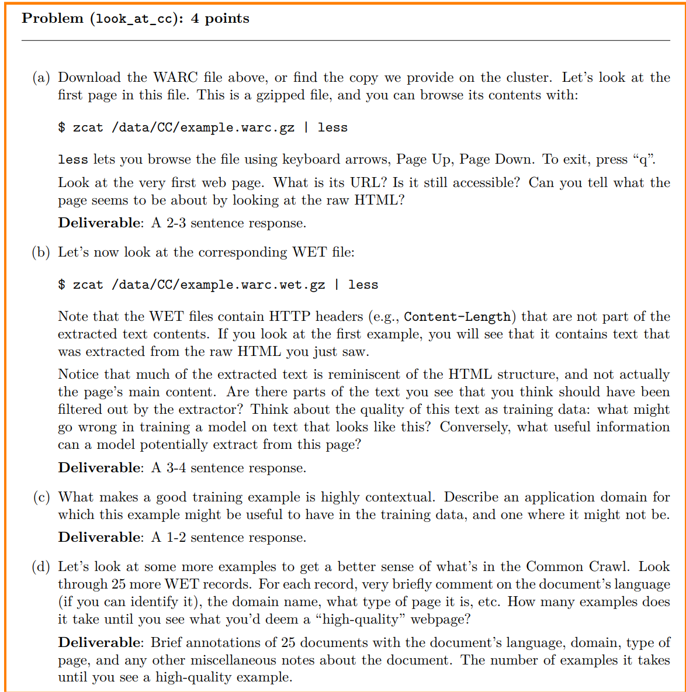
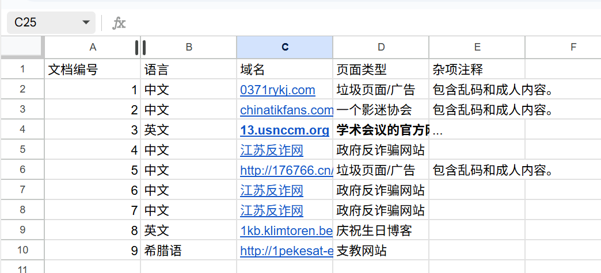
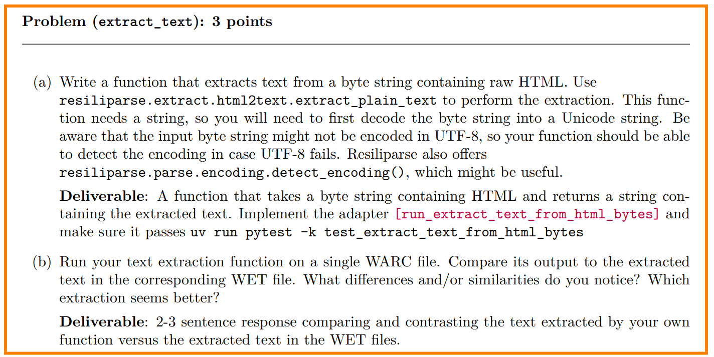
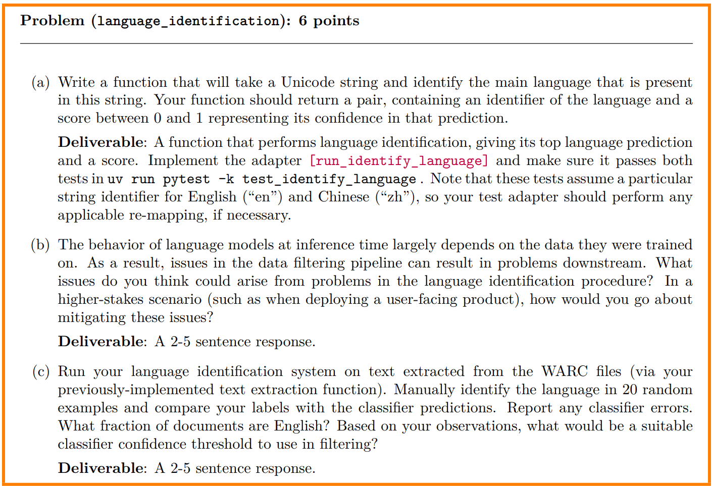
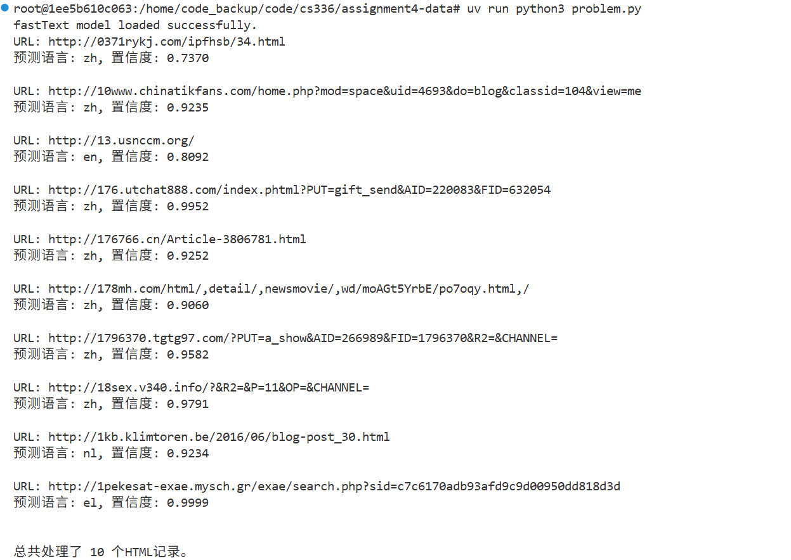
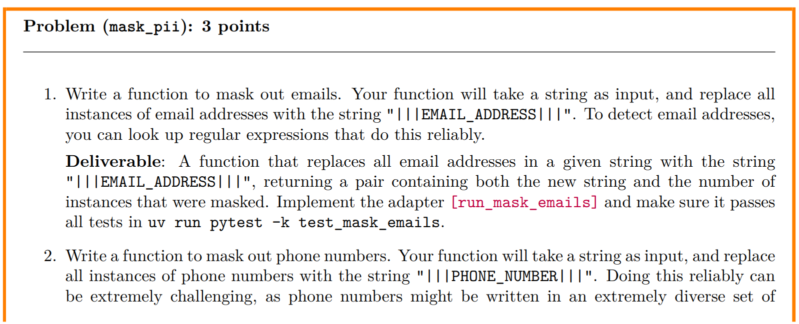
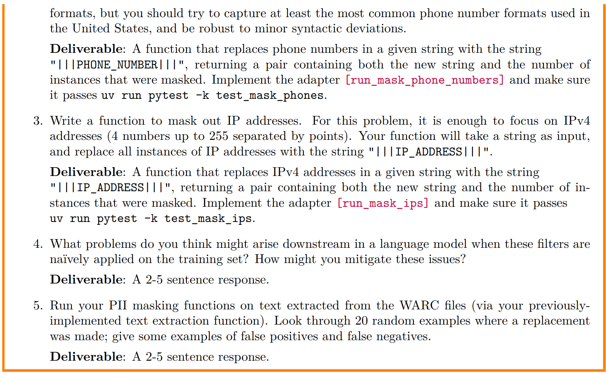
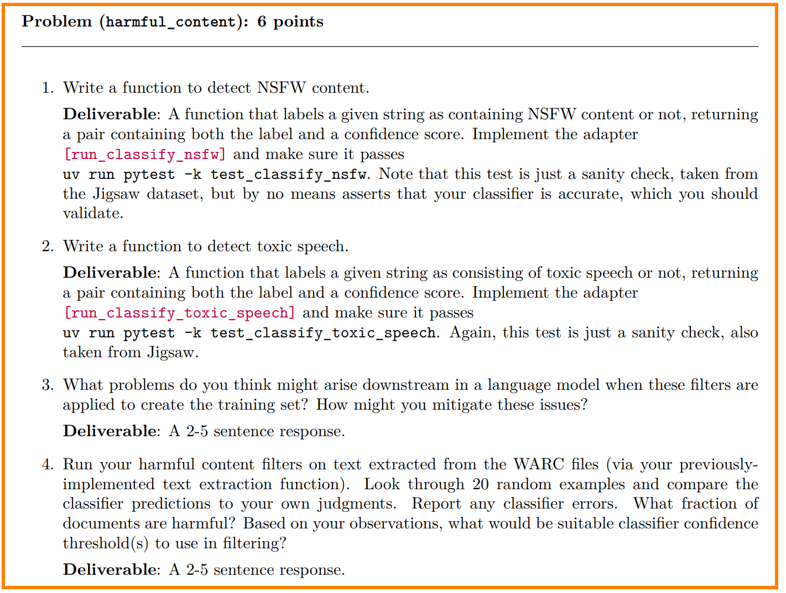
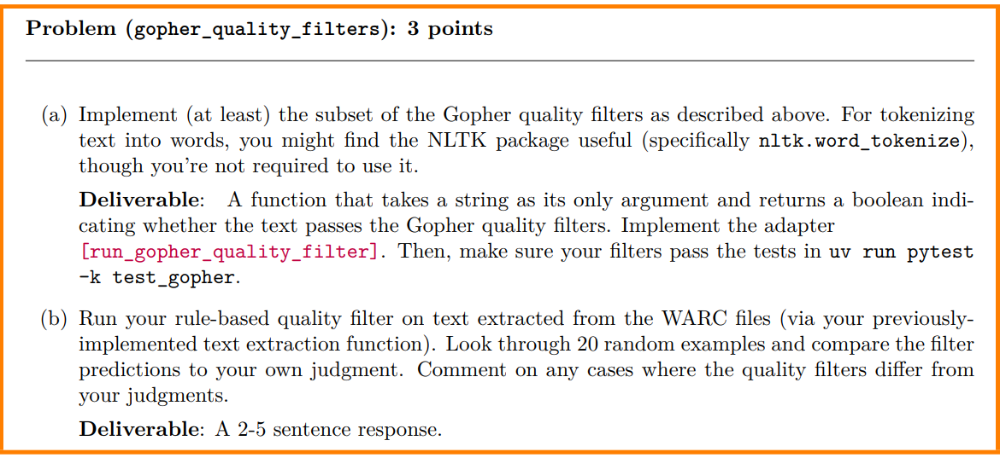

### problem1

 - 1. 这是打开文件之后的第一条内容
```bash
GET /ipfhsb/34.html HTTP/1.1
User-Agent: CCBot/2.0 (https://commoncrawl.org/faq/)
Accept: text/html,application/xhtml+xml,application/xml;q=0.9,*/*;q=0.8
Accept-Language: en-US,en;q=0.5
If-Modified-Since: Mon, 09 Dec 2024 16:27:57 GMT
Accept-Encoding: br,gzip
Host: 0371rykj.com
Connection: Keep-Alive


WARC/1.0
WARC-Type: response
WARC-Date: 2025-04-17T14:56:33Z
WARC-Record-ID: <urn:uuid:c2d1a8c1-6724-4f42-af88-1f9cbf5e6b3d>
Content-Length: 49275
Content-Type: application/http; msgtype=response
WARC-Warcinfo-ID: <urn:uuid:7cd96d88-0017-4446-8d17-4518dc8c22ec>
WARC-Concurrent-To: <urn:uuid:8c087fc9-8521-49ae-b5a3-4a93f89ff682>
WARC-IP-Address: 154.85.233.132
WARC-Target-URI: http://0371rykj.com/ipfhsb/34.html
WARC-Protocol: http/1.1
WARC-Payload-Digest: sha1:QRB4PRBO4ISKZ2R7FTTKK2HSFZPBRCPH
WARC-Block-Digest: sha1:EG5SMBVSDDLVPETNUZNUQCL23C573D2T
WARC-Identified-Payload-Type: text/html
```
用F12访问发现无法访问

<html>
<head><title>502 Bad Gateway</title></head>
<body>
<center><h1>502 Bad Gateway</h1></center>
<hr><center>nginx</center>
</body>
</html>
<!-- a padding to disable MSIE and Chrome friendly error page -->

 - 2.在第一个网站的HTML中包含成人内容和广告（包含广告的地址，电话），这些都应该被过滤；负面影响: 在这种文本上训练模型会引入大量噪声。模型可能会学习到不连贯、不完整的语言模式，导致生成不通顺的句子。此外，如果这些内容包含成人或有害信息，模型可能会习得不安全的行为或偏见。潜在有用信息: 尽管存在大量噪声，但模型或许能从像“上海林频仪器股份有限公司”这样的专有名词中学习到实体信息。如果数据清理得当，这些信息可以用于构建知识图谱或识别特定领域的词汇。

- 3
    - 有用场景:爬虫或垃圾内容识别：如果你正在构建一个用于识别网络垃圾、广告或不安全内容的分类器，那么包含这种文本的样本将是非常有用的。它可以作为负面或低质量数据的训练示例。

    - 无用场景:通用语言模型预训练：对于像 GPT、BERT 这样旨在学习通用语言知识和生成连贯文本的模型来说，这种充满乱码、广告和非主体内容的文本是无用的，因为它会引入噪声，降低模型的语言能力。

 - 4.
看了9个有3个是垃圾网站，比例蛮高的

### problem2


(b)代码在`problem.py`

### problem3

(b)错误的语言识别可能导致模型在训练时混入不相关的语言数据（例如，将德语文档错误地标记为英语），从而降低模型的语言能力和泛化能力。模型可能会学到错误的模式或产生“幻觉”，导致在推理时出现语法错误或不连贯的输出。
 - 更高风险的场景中，我们可以采取以下措施来缓解这些问题：

    * 多模型验证：使用多个独立的语言识别模型进行交叉验证。只有当所有模型的预测结果都一致时，才接受该文档。

    * 设置高置信度阈值：在过滤阶段，只保留置信度得分高于一个较高阈值的文档。虽然这可能导致数据量减少，但能显著提高数据质量。

    * 人工审核：在关键的数据子集上，引入人工审核流程，对模型预测结果进行抽样检查和纠正，以确保最高质量的数据进入训练流程。

(c)代码在`problem.py`,结果基本正确


### problem4


4. 首先，模型可能会丢失重要的句法结构和上下文模式。例如，如果它从不看到电子邮件地址或电话号码的格式，它可能无法在生成任务中正确地处理这些信息，导致生成的内容不自然或不完整。其次，过度泛化的替换（如将所有 IP 地址替换为 |||IP_ADDRESS|||）会破坏命名实体之间的语义关系，例如区分不同的公司 IP 地址。

5. 有很多假阳性,代码在`mask.py`

* **URL:** `http://0371rykj.com/ipfhsb/34.html`
    * **被遮蔽的实体数量：** 电话=2
    * **问题：** 原始文本片段中完全没有看到任何电话号码。这表明你的正则表达式可能匹配到了类似 `久久久久` 或其他看起来像数字序列的非电话号码文本。这是一个典型的假阳性。

* **URL:** `http://10www.chinatikfans.com/...`
    * **被遮蔽的实体数量：** 电话=1
    * **问题：** 原始文本片段中没有电话号码。这里可能匹配了像 `4693` 或 `104` 这样的数字序列，但这些数字在上下文（`uid=4693`，`classid=104`）中显然不是电话号码。这也是一个假阳性。

* **URL:** `http://3rte.com.br/product/...`
    * **被遮蔽的实体数量：** 电话=2，邮箱=1
    * **问题：** 原始文本片段中，我们只看到了 `3RTE` 和一些 URL。你的函数可能将 `35` 或 `3` 这样的数字片段误认为是电话号码的一部分，或者将 URL 中的某些部分错误地识别为邮箱。例如，`/` 和 `@` 符号的组合有时会误导简单的正则表达式。这也是假阳性。


### problem5

s

3. 在训练集上天真地应用有害内容过滤器可能会导致数据分布的偏差。模型可能永远无法看到特定类型的内容，例如脏话或冒犯性语言，从而导致它在遇到这些内容时显得“脆弱”或“不自然”。例如，模型可能不知道如何识别或以中性方式讨论这些概念，这对于需要处理有害内容的 AI 应用（如内容审核或具身智能中的情感识别）来说是至关重要的。为了缓解这些问题，我们可以分层过滤训练数据：保留一小部分（例如 1%）的有害内容，并进行特定标签处理，以允许模型学习其模式，同时防止它生成有害内容。
4. 代码在`toxic.py`
对于明显的有害内容（特别是那些包含高频有害词汇的）效果很好，但对于非英语文本、无害的通用词汇或需要更深层次上下文理解的内容，它很容易出错。

### problem6

都是`1.py`下载数据集
2. 在quality.py中，预测基本正确